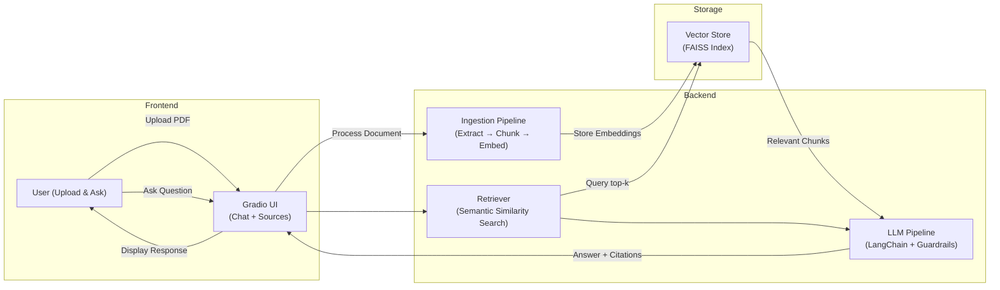

# 📜 Smart Contract Summary & Q&A Assistant


An enterprise-ready **AI-powered legal assistant** built using **Retrieval-Augmented Generation (RAG)**.
The system enables users to upload contracts and ask contextual questions while ensuring:

* ✅ Grounded answers
* ✅ Strict source citations
* ✅ Minimal hallucination
* ✅ Modular & scalable architecture

---

# 🚀 Core Capabilities

## 📄 Document Processing

* PDF ingestion using PyMuPDF
* Context-aware recursive chunking
* Configurable chunk size & overlap

## 🧠 Retrieval-Augmented Generation (RAG)

* Embedding generation (SentenceTransformers)
* High-speed semantic retrieval via FAISS
* Top-k similarity search
* Context grounding before LLM inference

## 🤖 LLM Integration

* GPT-4o-mini via GitHub Models API
* Prompt-engineered guardrails
* Deterministic answer formatting
* Fallback-ready architecture

## 🛡️ Guardrails & Safety

* Context-only answering
* Automatic citation enforcement
* Hallucination mitigation
* Local vector storage (no external sharing)

## 🖥️ Interactive UI

* Gradio-based modern web interface
* Upload & Chat separation
* Live chat history
* Source references displayed inline

---

# 🏗️ System Architecture

## High-Level Architecture

```
User → Gradio UI → FastAPI Backend → RAG Pipeline
                                      ↓
                              Vector Database (FAISS)
                                      ↓
                                   LLM API
```

---

## 🔄 End-to-End System Flow



---

# 🛠️ Technology Stack

| Layer             | Technology                       |
| ----------------- | -------------------------------- |
| Language          | Python 3.12+                     |
| LLM Orchestration | LangChain                        |
| Vector Database   | FAISS                            |
| Embeddings        | HuggingFace SentenceTransformers |
| LLM Provider      | GPT-4o-mini (GitHub Models API)  |
| PDF Parsing       | PyMuPDF                          |
| UI                | Gradio                           |
| Backend           | FastAPI                          |

---

# ⚙️ Installation

## 1️⃣ Clone Repository

```bash
git clone https://github.com/yourusername/smart-contract-assistant.git
cd smart-contract-assistant
```

## 2️⃣ Configure Environment

Create `.env` file:

```env
GITHUB_TOKEN="your_github_pat_here"
```

## 3️⃣ Install Dependencies

```bash
pip install -r requirements.txt
```

---

# ▶️ Running the Application

```bash
cd app
python ui.py
```

Then open the local URL provided by Gradio.

---

# 📂 Project Structure

```
smart-contract-assistant/
│
├── app/
│   ├── ingest.py
│   ├── vectorstore.py
│   ├── retriever.py
│   ├── ui.py
│
├── data/
├── faiss_index/
├── requirements.txt
└── README.md
```

---

# 📊 Performance Targets

| Metric            | Target                            |
| ----------------- | --------------------------------- |
| Response Time     | < 5 seconds                       |
| Retrieval Depth   | Top-3 / Top-5 chunks              |
| Embedding Latency | < 200ms per chunk                 |
| Index Build       | Linear scaling with document size |

---

# 📈 Evaluation Strategy

* Manual validation against contract clauses
* Retrieval accuracy testing
* Hallucination detection checks
* Top-k relevance scoring
* Response grounding verification

---

# 🔐 Security Considerations

* Local FAISS storage
* No external document persistence
* API keys stored via environment variables
* Context-bound LLM responses

---

# 🔄 Scalability & Production Readiness

* Modular pipeline architecture
* Swappable vector databases (FAISS / Chroma)
* LLM provider abstraction layer
* Fallback model support (local LLM)
* Docker-ready structure

---

# 🧠 Design Principles

* Grounded generation over free-form LLM output
* Separation of ingestion and inference
* Minimal token waste
* Extensible architecture
* Maintainable codebase

---

# 🚀 Future Enhancements

* Multi-document retrieval
* Contract auto-summarization
* Role-based access control
* Docker & Kubernetes deployment
* Evaluation dashboard
* CI/CD integration

---

# 📄 License

MIT License